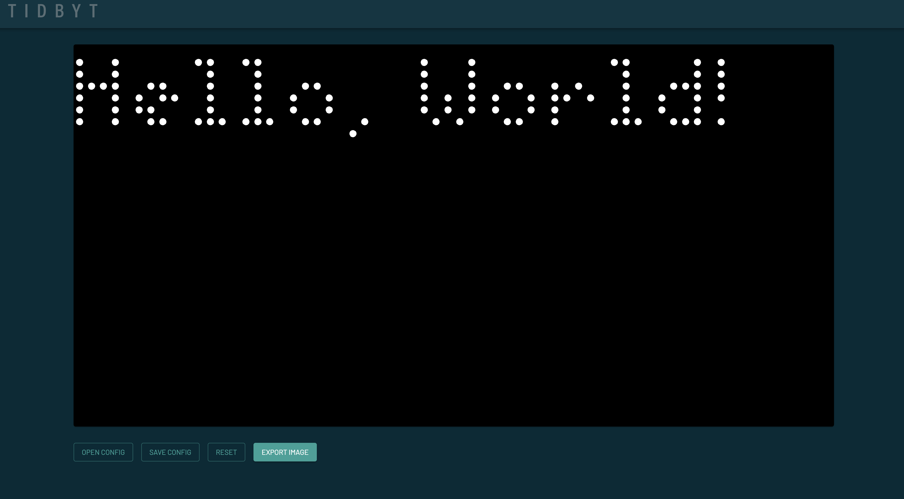

# pixlet-docker

A dockerfile for [Tidbyt Pixlet](https://github.com/tidbyt/pixlet)

This allows you to develop pixlet apps and push them to Tidbyt devices

There are two different Docker containers in this repo, each with two different Dockerfiles depending on the target
host:

## Web App

This container is for serving the Web App, which is used to design Pixlet apps.



### Standard Docker

##### webapp/standard/Dockerfile

This is for standard Docker containers, such as Docker Desktop for Windows or Linux.

#### Install

``` bash
# Build from the root directory using Docker BuildX
docker buildx build --build-arg PIXLET_VERSION=0.28.0 -f webapp/standard/Dockerfile -t pixlet_standard_webapp .

# Run the container
docker run -p 5000:5000 --name Pixlet pixlet_standard_webapp
```

Visit `http://localhost:8080` in your browser.

### Home Assistant Add-On

##### webapp/hassio/Dockerfile

This is a customized Dockerfile for using the container as a Home Assistant add-on.

#### Install

**Full instructions [here](https://developers.home-assistant.io/docs/add-ons/tutorial/)**

- Make a `pixlet` folder in your Home Assistant `addons` folder
- Copy all the contents of `webapp/hassio` to the `pixlet` folder
- Navigate to the Add-On Store in Home Assistant, refresh add-ons, and you should see Pixlet
  [](https://my.home-assistant.io/redirect/supervisor_store/)
- Install Pixlet and navigate to the Web UI at `http://<your-hassio-ip>:9142`

## Push Server

This container is for pushing Pixlet-compatible `.star` apps to Tidbyt devices.

### Standard Docker

##### push/standard/Dockerfile

This is for standard Docker containers, such as Docker Desktop for Windows or Linux.

#### Install

``` bash
# Build from the root directory using Docker BuildX
docker buildx build --build-arg PIXLET_VERSION=0.28.0 -f push/standard/Dockerfile -t pixlet_standard_push .

# Run the container
docker run -p 5000:5000 --name Pixlet_Push pixlet_standard_push
```

Push a `.star` file to a Tidbyt device via the `/push` endpoint:

``` bash
curl -X POST -F "device_id=<TIDBYT_DEVICE_ID>" -F "api_key=<TIDBYT_API_KEY>" -F "file=@/path/to/your/file.star" http://localhost:5000/push
```

The container will render and push the file to the device.

You can find your device ID and API key in the Tidbyt app.

### Home Assistant Add-On

##### push/hassio/Dockerfile

This is a customized Dockerfile for using the container as a Home Assistant add-on.

#### Install

**Full instructions [here](https://developers.home-assistant.io/docs/add-ons/tutorial/)**

- Make a `pixlet` folder in your Home Assistant `addons` folder
- Copy all the contents of `webapp/hassio` to the `pixlet` folder
- Navigate to the Add-On Store in Home Assistant, refresh add-ons, and you should see Pixlet
  [](https://my.home-assistant.io/redirect/supervisor_store/)
- Install Pixlet

Push a `.star` file to a Tidbyt device via the `/push` endpoint:

``` bash
curl -X POST -F "device_id=<TIDBYT_DEVICE_ID>" -F "api_key=<TIDBYT_API_KEY>" -F "file=@/path/to/your/file.star" http://<your-hassio-ip>:5000/push
```

The container will render and push the file to the device.

You can find your device ID and API key in the Tidbyt app.

#### Shell Command

Once as a Home Assistant add-on, you can also use the `push` service via a `shell_command` in Home Assistant.

Add the following to your `configuration.yaml`:

``` yaml
shell_command:
  tidbyt_display: 'curl -X POST -F "device_id=<TIDBYT_DEVICE_ID>" -F "api_key=<TIDBYT_API_KEY>" -F "file=@/config/addons_config/pixlet/{{ file }}.star" http://localhost:5000/push
```

Then, you can call the service from an automation:

``` yaml
service: shell_command.tidbyt_display
data: 
  file: coffee
```

The above example will push the `coffee.star` file in your `config/addons_config/pixlet` folder to your Tidbyt device.

- The container automatically creates the `config/addons_config/pixlet` folder when it starts up, so it's recommended to
  use this folder to store your `.star` files.
